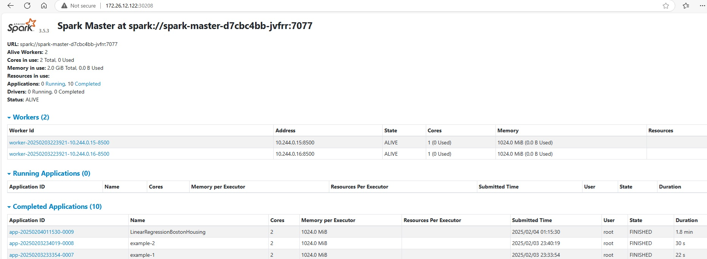
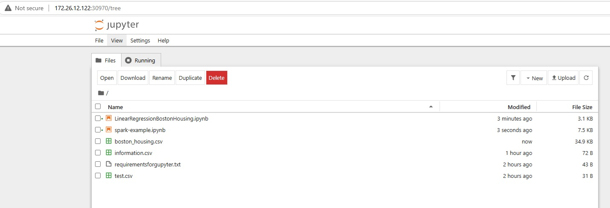

# <p width=600 align="center"><b>Build Spark cluster with Jupyter notebook on Minikube</b></p>

#### 1.  Introduction to Spark cluster and Jupyter 
   
In this post, we will walk through the process of setting up a Jupyter Notebook integrated with a Spark cluster. This setup will enable data scientists and developers to leverage Jupyter Notebook for working with PySpark under kubernetes platform. Additionally, we will explore the capabilities of Jupyter Notebook when combined with a Spark cluster.
One of the key features of this setup is the flexibility to configure the Spark cluster according to specific needs. You can choose to **scale out** (increase the number of pods in the Spark cluster) or **scale up** (increase the CPU and memory resources for each pod). To achieve this, we will deploy the Jupyter Notebook on **Minikube**, utilizing Kubernetes pods to manage the Spark cluster's scalability. This approach ensures that the system can dynamically adapt to varying workloads and computational demands. We will provide a comprehensive guide to building this setup on Minikube, including detailed configuration settings for Jupyter, the Spark master node, and the Spark worker node. During my research, I struggled to find a single article or post that offered complete, step-by-step configuration instructions. As a result, I had to troubleshoot by analyzing the logs for both the worker and master nodes during worker registration and spark-submit execution. This allowed me to identify and resolve issues as they arose. Also the situation is different when we run spark cluster on kubernetes. We have to deal with services and sometimes with ip adrress for the pods.

This post explain about using spark on minikube platform. It does not explain the fundemental of spark and also it does not explain about the fundemental of Kubernetes

#### 2.  The main reason behind Spark and Jupyter
   
The integration of **Apache Spark** and **Jupyter Notebook** is a powerful combination that addresses several key challenges faced by data scientists and developers. Below are the main reasons behind using Spark with Jupyter. Beside to this integration, we are building Spark cluster and Jupyter notebook on Minkikube to increase the scalability by scaling out and up.

#### 3.  The Types of Spark cluster on Minikube
   
In this post, we are building spark cluster on Minkube by using standalone cluster. We will give the driver to initiate the run and master has to control the cluster. There is another way to allow the Kubernetes to control the Spark jobs. See the table below that explain the two approaches and the differences

| **Feature** | **Spark Standalone Cluster Manager** | **Kubernetes as Cluster Manager** |
|----|----|----|
| Resource Management | Managed by Spark standalone | Managed by Kubernetes |
| Scheduling | FIFO or Fair Scheduler | Kubernetes scheduler |
| Containerization | Not containerized by default | Runs as containers (pods) |
| Scalability | Limited | Highly scalable |
| Integration with Kubernetes | Not supported(the cluster works independent) | Native integration |
| Cluster configuration | Should happen before the run. | The run start and the driver responsible to create the cluster(during the run) |
| Complete the run | The cluster will stay run master and executors pods | The Kebernetes will kill the executors and we c4an delete the main driver |
| deploy-mode in spark-submit | Cluster for python | Client for python |
| Master URL in spark-submit | k8s://https://\<kubernetes-api-server-url\> | spark://\<spark-master-service\>:7077 |
| Fault Tolerance | In case of the driver fail, the job will fail also and we have to clean up the executors (restart). This will affect the high availability | In case of the driver fail, the Kebernetes can start the driver |

#### 4-  The architecture of our model<br>
**A. Spark architecture**
In our model, we will have one edge node, master node and worker Node(s). See the figure-1 below.

<p align="center">
<br>
Figure-1
</p>

The pods in our mode:

**- Edgenode**  
In our model, the edgenode is implemented as a single pod. To provide a clear definition, the edgenode is a distinct component separate from the Spark cluster. It contains the Spark client tools and the necessary code to execute tasks. The edgenode pod is responsible for running the spark-submit command, which enables it to connect to the master node of the Spark cluster and coordinate with the worker nodes to execute the code.
In Spark, code execution can occur on either the worker pods or the master pod when initiated from the edgenode. However, in most systems, it is preferred to run the edgenode (pod) separately from the Spark cluster for security reasons. This separation ensures that any issues arising from the client side during code execution do not impact the stability or functionality of the Spark cluster.

<p align="center">
<br>
Figure-2
</p>

The main components of in the edgenode pod is 

✅ **The driver** this part is generated during the run of spark-submit.This part is generated during the run of spark-submit. It contains sparkcontext. As well this component is responsible to start the negation with spark master.

✅ **SparkContext** is launched on the edge node. It contains the code.
It should be inside the driver box.  
  
✅ **The driver's Block Manager** is primarily used for:
  . Storing metadata about data blocks (e.g., locations of blocks in the
  cluster).
  . Managing broadcast variables (which are sent to all executors).
  . Handling small amounts of data that need to be stored locally on the
  driver.
  . it responsible of caching and managing data on disk

✅ **Driver Web UI**  
The **Driver Web UI** in Spark displays the **processing details** for the **Spark DAG (Directed Acyclic Graph)**. The DAG represents the logical execution plan of a Spark application, showing how the application's tasks are divided into stages and how data flows between them.

✅ **Block manager**


✅ **Driver port**: Used for communication with executors and context port  

✅ **Block Manager Port**: Used for data transfer between driver and executor.

✅ **Context Port:** it’s dynamic and it’s use internally with driver port in the edge node

✅ **Webport**: Used for accessing the Spark application's Web U (default: 4040)

Note: We mention the main ports in the spark cluster that play the main role.

 **- Master node:**  
 The master node (pod) is responsible for managing resources for executors depending on the requirements for the spark-submit that comes from edgenode. Also it maintains the meta data for executors (registered executors). 

 The main components of in the master pod is 
  
✅ **Spark Master Process**: This process manages the entire cluster and assigns work to available worker nodes. The main port is 7077. The main roles for the master node.

✅ **Resource Allocation**: Assigns CPU and memory to workers.  

✅ **Job Scheduling**: Distributes tasks to worker nodes. FIFO (First In, First Out) asDefault.  

✅ **Monitoring**: Tracks active workers and running applications. Fault Tolerance: Reassigns tasks if a worker fails.  

✅ **Cluster Manager**: the cluster manager keeps track of available worker nodes and assigns tasks.

✅ **WebUI**: It’s real time monitoring to display Registered worker nodes. Running and completed applications. Resource utilization (CPU, memory).

The main ports in the master node

✅ **Master nofr port**
This port is listening to the communication from workers.

✅ **web port** 
This port is responsible for the web part for the master to display the cluster information and the registered workers
  

<p align="center">

<br>Figure-3
</p>

**-Worker node:**
The worker node (pod) is responsible for data processing and save the data locally. Also the worker is responsible for duplocate the data to another nodes. The worker get the inforamtion through the communication with master node. The worker cna have one or more executor depending on configuration bt the most cases that one worker has one executor

The main components of in the worker pod is

✅ **Executor**
  Executes tasks and manages data. The executor is responsible for storing and managing data in memory or on disk like cached RDDs, shuffle data. Also it responsible for communicating with the driver to report task status for the worker. The main component in the executor is task runner. It responsible for computation on the assigned partition of data and manage the resources for the executor. Also the executor has schedular. It receivce tasks from the driver and assigns the tasks to the executor's.
  
✅ **Block manager**
  Manages local data blocks and serves them to other nodes.

✅ **Web UI executors**
  Displays a list of all jobs submitted to the Spark application. Shows the progress, stages, and tasks of each job. Provides information about completed, active, and failed jobs.

✅ **Shuffle manager**
  Handles shuffle operations and data transfer

The main ports in the worker pod

✅ **Executor port**

  This is the main port used by the executor to communicate with the driver and other executors.

✅ **Executor Web port**

  Each executor has a Web UI that provides metrics and debugging information about the tasks running on that executor.

✅ **Shuffle port**
  this port is used by the shuffle service to serve shuffle data to other executors


<p align="center">

<br>Figure-3
</p>

**B. Spark Cluster operation**
**- The cluster starts**

The **Master Spark pod** starts first, exposing a service on port **7007**. This port is used for internal communication within the Spark cluster. Once the master is up and running, the **worker pods** begin to start.

During their initialization, the workers send registration request to the master pod. This request includes the worker's **IP address** and a **specific port** (e.g., **8500**) that the worker will use for communication. The registration process ensures that the master is aware of the worker's presence and can assign tasks to it.

For example:

- The **master** listens on IP 192.168.1.100 and port 7007.

- A **worker** with IP 192.168.1.101 sends a registration request to the
  master at 192.168.1.100:7007, specifying its own communication port
  as 8500.

Once registered, the master and worker communicate over their respective ports (7007 for the master and 8500 for the worker). The master assigns tasks to the worker, and the worker reports task status back to the master.

**The spark-submit**

When you submit a Spark job on the **edgenode pod**, the system initializes the **driver** and **Spark context**. Each of these components is assigned specific ports for communication. The driver then requests the **spark** **master** to allocate available resources (workers) based on memory and CPU requirements. The master responds by providing the registered executors (workers) that meet the criteria.

Once the resources are allocated, the driver establishes communication with the workers. During this process:

- The driver creates a **block manager** and starts a **GUI** on
  port **4040** to monitor the progress of the spark-submit job.

- Each worker pod also initializes its own **block manager** to manage
  data blocks locally.

After the setup is complete, the workers begin processing the tasks assigned by the driver.

To ensure the workers can access the necessary files for processing, the input files must be stored in a **distributed storage system in Minikube**. For example:

- In a **Minikube** environment, you can use **Persistent Volumes (PV)** and **Persistent Volume Claims (PVC)** to store and share files across worker pods.

- Alternatively, you can use **Amazon S3** or similar cloud storage solutions, allowing the workers to directly access the files stored in S3 buckets.
</p>

#### 5. Persistent Storage Types
In our model, we use two kinds of storage. The file source storage and temporarily storage
##### 🤗 File source storage
We use distributed storage, allowing multiple pods to share the same storage resources. Currently, we follow a simple approach by accessing a specific path on the node and using a Persistent Volume Claim (PVC) to reference it.

For production environments, a more scalable and reliable distributed storage solution is recommended, such as Red Hat OpenShift Data Foundation (ODF), Portworx, or other market-leading options.

All pods should share a single PVC, where we store source files, data, and Jupyter notebooks, ensuring seamless access and consistency across workloads.

##### 🤗 Temporarily storage
These files are used during spark-submit and are only needed while the job is running. Spark automatically generates these intermediate files for processing.
In our setup, pods point to the /tmp folder by default, but we can customize this by setting the spark.local.dir parameter. This can be done in two ways:

###### During spark-submit
>--conf spark.local.dir=/spark-temp

###### spark-defaults.conf
>spark.local.dir /spark-temp
>Note: the location in $SPARK-HOME/conf

Note: It is not recommended to use distributed storage (PVC) for temporary files. Spark generates a large number of temporary files during execution, which can overload the distributed storage system and impact overall performance. Instead, temporary storage should be assigned to fast local disks.

#### 6. Implementation steps

**A. Build the images**

If you want you can pass this section and you can get the images from:
https://hub.docker.com/repository/docker/alaasalmo/spark-jupyter
https://hub.docker.com/repository/docker/alaasalmo/spark

The yaml files are pointing to these images in the docker hub
</br>

**- Build the master and worker image**

File requirements (Dockerfile, entrypoint.sh , requirements.txt)  
```
cd master-worker
docker build -t spark:3.5.3.1 -f Dockerfile .
docker images
docker tag <docker-image> alaasalmo/spark:3.5.3.1
docker push alaasalmo/spark:3.5.3.1
```
**- Build edgenode with jupyter**

File requirements (Dockerfile, entrypointjuypter.sh, requirements.txt,
requirementsforgupyter.txt)
```
cd spark-jupyter
docker build -t spark-jupyter:3.5.3.1 -f Dockerfile .
docker images
docker tag <docker-image> alaasalmo/spark-jupyter:3.5.3.1
docker push alaasalmo/spark-jupyter:3.5.3.1
```
**B. Minikube**
```
Start Minikube
minikube delete --all
minikube start --driver=hyperv --memory 8192 --cpus 6
```
**C. Build the pods**

- **Build PVC storage**
```
cd pvc
kubectl apply -f pvc.yaml
kubectl get pvc
```
We need to create PVC and the PV will create automatically

**D. Build the master and worker with services**
```
cd master-worker
kubectl apply -f spark-master.yaml
kubectl get pods
Note: we should see the pod(spark-master) running
kubectl apply -f spark-worker.yaml
kubectl get pods
Note: we should see the pod(spark-worker) running
minikube service web-spark-master --url
```
**E. Build jupyter edgenode yaml with service pod**
```
cd spark-jupyter
kubectl apply -f spark-jupyter.yaml
kubectl get pods
Note: we can the pod (spark-edgenode). It should be in running status
minikube service spark-jupyter --url
Note: get the URL (get the first URL)
```

#### 7-  Using the system

**- Check Spark cluster**
```
minikube service web-spark-master --url
Use the output on URL in the browser
```
In this page we can admin the cluster and check the submitted jobs



**- Get the Jupyter notebook**
```
minikube service web-spark-master --url
Use the output on URL in the browser
```
In this page we can download/upload data files and jupyter notebooks. We can use the files in the default path. The default path is /spak/user/



**- Jupyter notebooks examples**

A. spark-example.ipynb
In this example, we use information.csv

<a href="spark-jupyter/spark-example.pdf">spark-example.pdf</a> Or <a href="spark-jupyter/spark-example.ipynb">spark-example.ipynb</a>


B. linearRegressionBostonHousing.ipynb
In this example, we use boston_housing.csv

<a href="spark-jupyter/linearRegressionBostonHousing.pdf">linearRegressionBostonHousing.pdf</a> Or <a href="spark-jupyter/linearRegressionBostonHousing.ipynb">linearRegressionBostonHousing.ipynb</a>


✅ 🤗